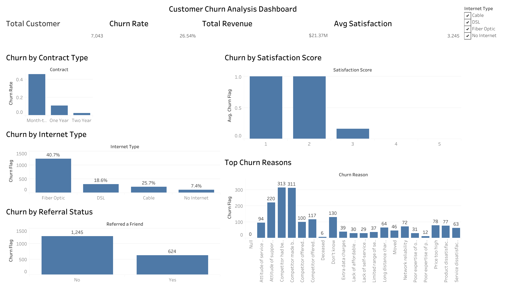

# Customer Churn Analysis

## Overview

This project analyzes customer churn using the Telco Customer Churn dataset. The goal is to identify factors associated with customer churn, perform statistical analysis, build machine learning models, and create an interactive Tableau dashboard for business insights.

---

## Dashboard Preview

---

## Dataset

- Dataset: Telco Customer Churn Dataset
- Total Customers: 7,043
- Target Variable: Churn Label (Yes/No)

### Features Used

- Age
- Contract Type
- Internet Type
- Monthly Charge
- Total Revenue
- Satisfaction Score
- Referral Status
- CLTV

---

## Tools Used

- Python
- Pandas
- NumPy
- SciPy
- Scikit-Learn
- Matplotlib
- Seaborn
- Tableau Public
- Jupyter Notebook

---

## Exploratory Data Analysis

The analysis focused on understanding customer churn across different customer segments.

### Key Findings

- Overall churn rate was **26.54%**.
- Month-to-Month customers had the highest churn rate.
- Fiber Optic customers had the highest churn rate (**40.7%**).
- Customers who referred friends were less likely to churn.
- Lower satisfaction scores were associated with higher churn.

---

## Statistical Analysis

### T-Test

**Question:** Does customer satisfaction differ between churned and retained customers?

**Result:** p-value < 0.05

**Conclusion:** Customer satisfaction differs significantly between churned and retained customers.

### Chi-Square Test

**Question:** Is churn associated with marketing offers?

**Result:** p-value < 0.05

**Conclusion:** Churn and marketing offers are significantly associated.

---

## Machine Learning

### Models Developed

| Model | Accuracy |
|---------|---------|
| Logistic Regression | 96.24% |
| Random Forest | 95.60% |

### ROC-AUC Score

**0.984**

### Top Important Features

- Satisfaction Score
- Tenure in Months
- Total Revenue
- Monthly Charge
- Number of Referrals
- Contract Type

---

## Tableau Dashboard

The dashboard includes:

- Total Customers
- Churn Rate
- Total Revenue
- Average Satisfaction Score
- Churn by Contract Type
- Churn by Satisfaction Score
- Churn by Internet Type
- Churn by Referral Status
- Top Churn Reasons

### Dashboard KPIs

| Metric | Value |
|---------|---------|
| Total Customers | 7,043 |
| Churn Rate | 26.54% |
| Total Revenue | $21.37M |
| Average Satisfaction Score | 3.245 |

---

## Business Recommendations

- Improve customer satisfaction through proactive support and engagement.
- Encourage customers to switch from Month-to-Month to longer-term contracts.
- Strengthen referral programs to improve customer retention.
- Focus retention efforts on customers with low satisfaction scores.
- Investigate competitor-related churn reasons and improve service offerings.

---

## Author

**Laxmi Satyal**  
M.S. Computer Science  
Wright State University
